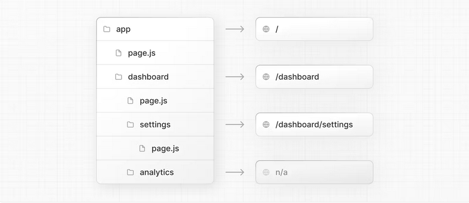

# Vínculos - README

Este é o repositório para o Front-End da Vínculos.

## Ferramentas utilizadas

No projeto Vínculos, utilizamos Next.JS para o runtime, React.Js como biblioteca, TailwindCSS e módulos CSS para estilização.

## Arquivos principais no Next.Js
#### layout.jsx

O arquivo `layout.jsx` é o template principal do aplicativo, nele podemos definir elementos comuns a todas as páginas, como cabeçalho, rodapé e menu de navegação.

Mude o valor de title para mudar título da guia no navegador no arquivo `layout.jsx`.

``` JSX
    export const metadata = {
    title: "Vínculos",
    description:
        "A plataforma que emprega e capacita pessoas com deficiências sensoriais",
    };
```

#### page.jsx

As páginas, por sua vez, são os arquivos que definem a estrutura e os componentes específicos de cada rota. Esses arquivos possuem o seguinte padrão de nomenclatura: `page.jsx`.

Neste arquivo teremos os componentes organizados da seguinte forma:

```JSX
    export default function Home() {
    return (
        <>
            <Componente />
            <Componente />
            <Componente />
            <Componente />
        </>
    )
    }
```

#### Componentes

Os componentes são blocos de construção reutilizáveis que podem ser utilizados em diferentes partes do aplicativo.

Os componentes devem ser organizados em uma pasta chamada `componentes`. Dentro dessa pasta, você pode criar subpastas para agrupar componentes relacionados, como `componentes/navbar`, `componentes/footer`, etc.

Eles serão estilizados pelos módulos de CSS na pasta <code>@/componentes/css</code>

### Arquivos e estrutura das pastas

No projeto Vínculos, existem diversos arquivos, divididos em duas categorias principais: **pages**, **componentes** e **layouts**.

Na pasta <code>@/app/</code> teremos todo nosso código principal que será renderizado.

Dentro dela, teremos o arquivo <code>page.jsx</code> e <code>layout.jsx</code>, que serão os arquivos de nossa homepage.

Assim, o roteamento de outras páginas em nosso projeto será feito por pastas dentro da pasta <code>@/app/</code>. 
Por exemplo:



## Nomenclatura

Os componentes devem seguir a nomenclatura `PascalCase`. Exemplos:

- `Navbar.jsx`
- `Footer.jsx`

## Roteamento

No Next.Js temos o roteamento baseado em pastas, assim, utilizamos o Componente do Next chamado de Link, ele funciona como uma tag `<a></a>`.

As pastas são os links dentro da propriedade <code>href=</code>.

Exemplo:

```JSX
    import Link from 'next/link';

    <Link href="/"> 
        Clique aqui para ir para a página home.
    </Link>

    <Link href="/sobre">
        Clique aqui para ir para a página sobre.
    </Link>
```

### Arquivos de Imagem

Imagens utilizadas no projeto devem ser colocadas na pasta `public/img`.

## Créditos

Projeto criado por [Vínculos](https://www.linkedin.com/company/100154077/admin/feed/posts/).

## Licença

Este projeto é licenciado sob a licença [MIT](LICENSE).
